# Klicko front-end

Front-end realizzato a partire dal template React + Vite.

Currently, two official plugins are available:

## 🛠️ Tecnologie Utilizzate

- [React.js](https://reactjs.org/)
- [Tailwind CSS](https://tailwindcss.com/)
- [React Router](https://reactrouter.com/)

## 📂 Struttura del Progetto

```
Klicko_fe/
├── public/
├── src/
│   ├── components/
│   ├── pages/
│   ├── App.jsx
│   └── ...
└── ...
```

## 🚀 Avvio del Progetto in Locale

### ✅ Prerequisiti

- Node.js (v14.x o superiore)
- Account Stripe con chiavi API

### 🔄 Clonazione del Repository

```bash
git clone https://github.com/Gianlu201/Klicko.git
```

---

### ▶️ Avvio Frontend

```bash
cd Klicko/frontend/Klicko_fe
npm install
```

1. Configura le variabili d'ambiente necessarie:

   - Endpoint per le chiamate al server
   - Chiavi API Stripe

2. Avvia l'applicazione:

```bash
npm run dev
```

## 📸 Anteprima

_Pagina Home_


_Pagina Esperienze_
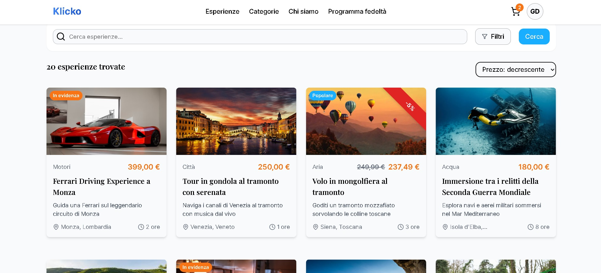

_Pagina Dettagli Esperienza_
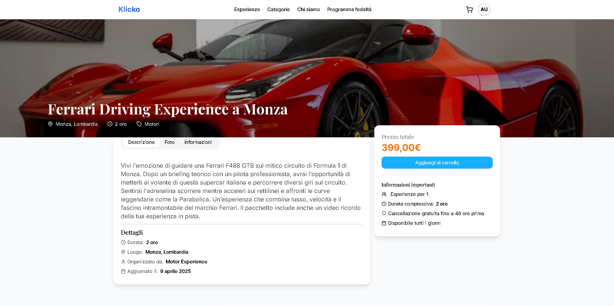

_Pagina Carrello_
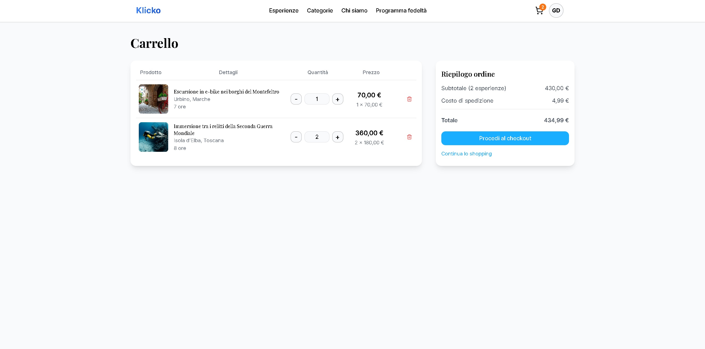

_Pagina Coupons_
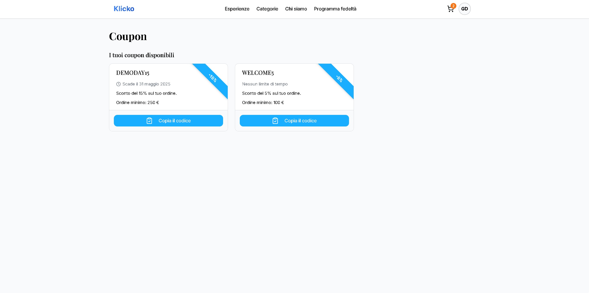

_Pagina CheckOut_
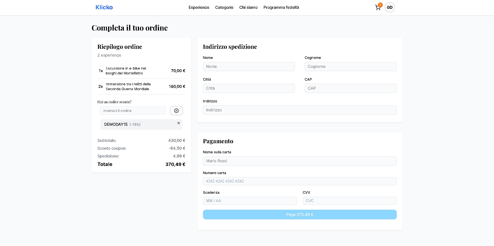

_Pagina Conferma Ordine_
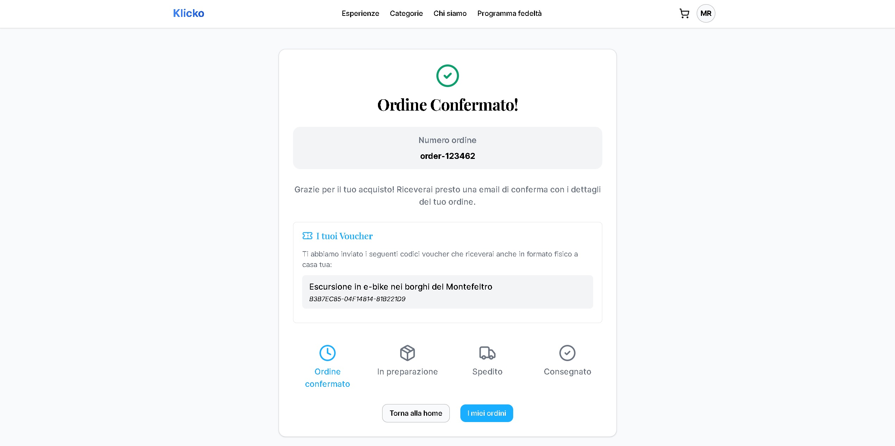

_Pagina Programma Fedeltà_
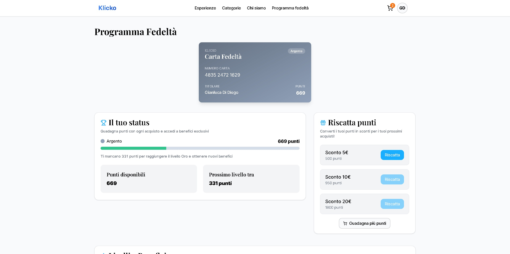

_Pagina Dashboard Ordini_
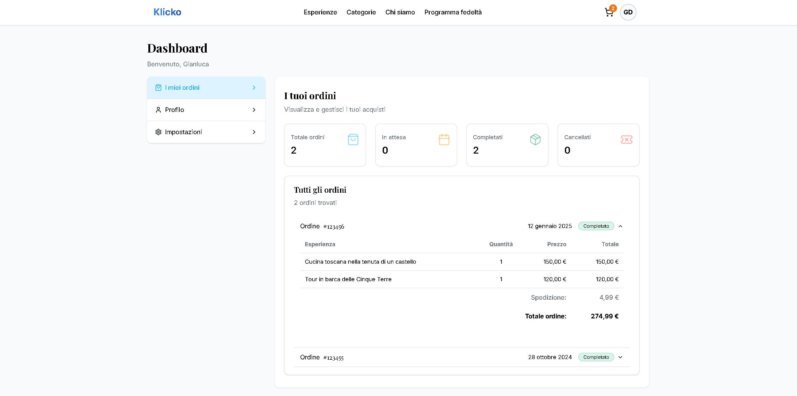

_Pagina Vouchers Riscossi_
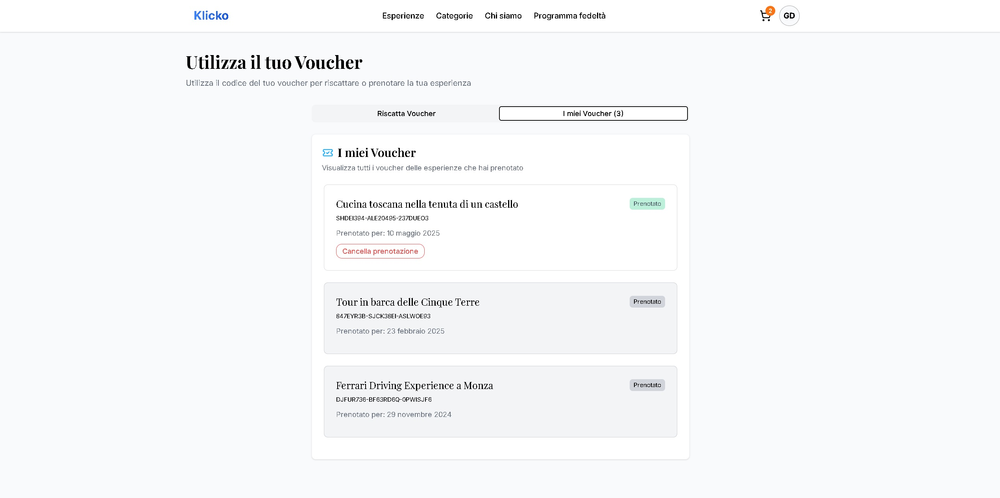

_Pagina Ricerca Voucher_
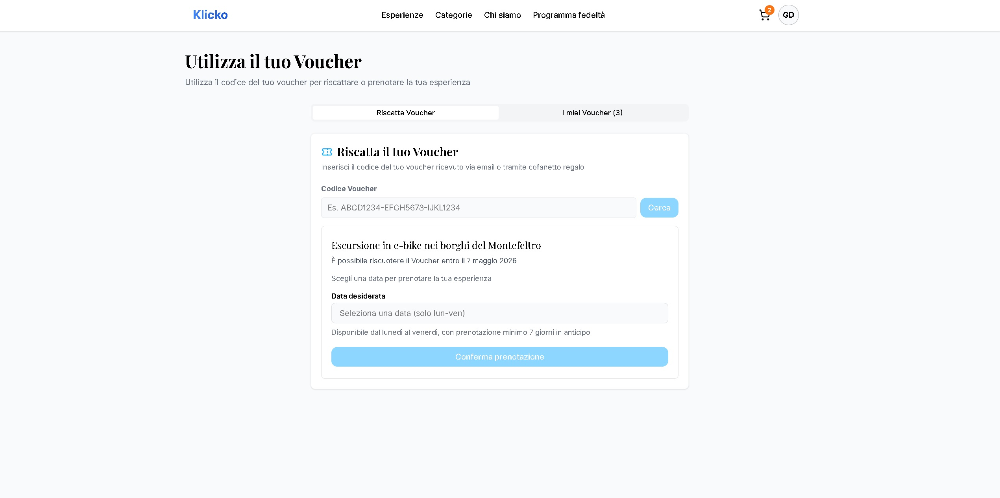

_Pagina Dashboard Venditore Esperienze_
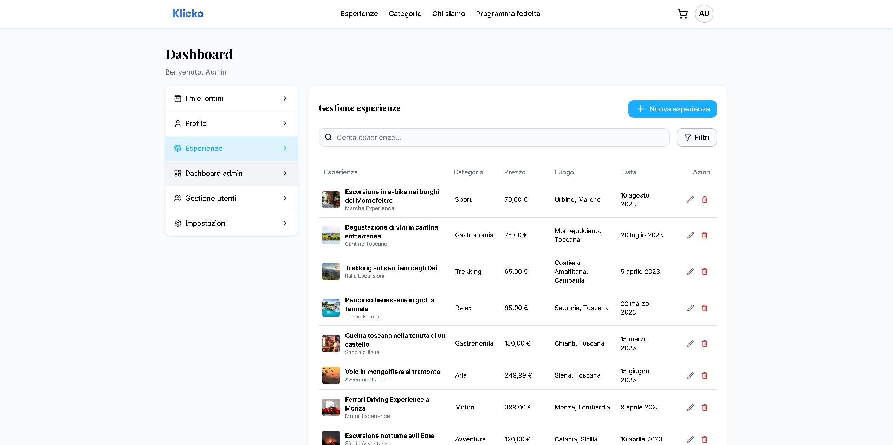

_Pagina Dashboard Venditore Form Esperienza_
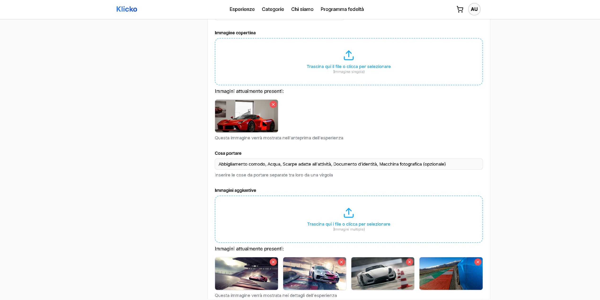

_Pagina Dashboard Admin Ordini Ricevuti_
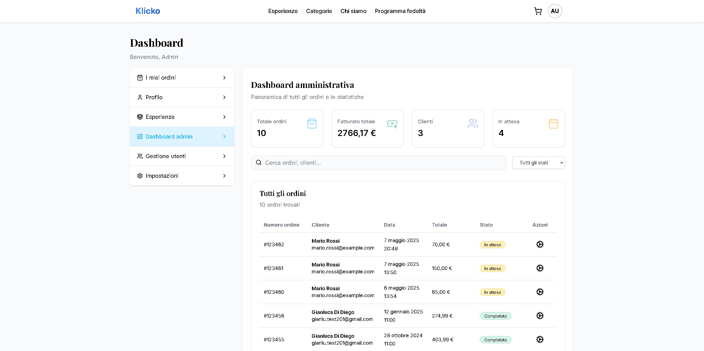

_Pagina Dashboard Admin Gestione Utenti_
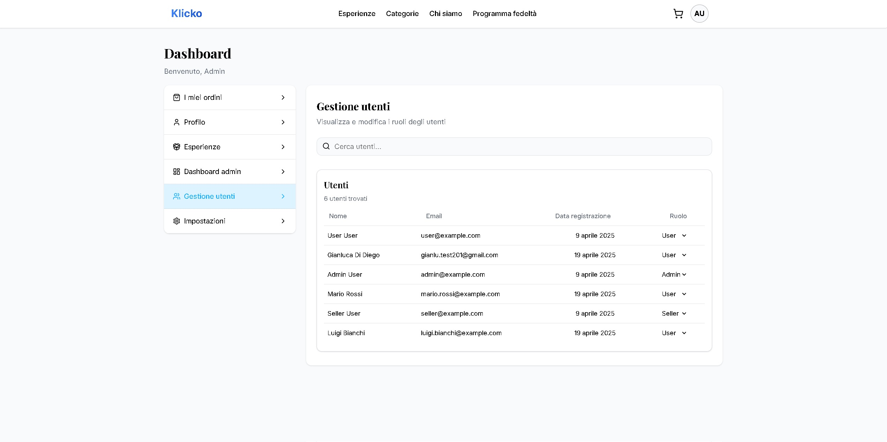

---

## 📬 Contatti

Per ulteriori informazioni o domande, contattami [@Gianlu201](https://github.com/Gianlu201)

---
